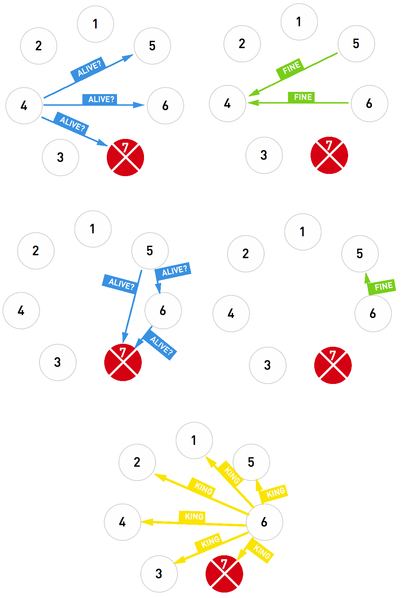

Тестовое задание
----------------

Дана распределенная система из N узлов. Необходимо реализовать алгоритм, по которому узлы договариваются, кто из них в данный момент является вождем. В каждый момент времени в системе может быть только один вождь, и если вождь пропадает (умер, недоступен, вышел на пенсию), в кратчайшие сроки нужно избрать нового.

Реализация состоит из двух частей:

1. Мониторинг текущего вождя
----------------------------
Раз в T секунд каждый узел посылает вождю сообщение PING, если в течение интервала 4×T вождь не ответил, его считают отстраненным от дел и текущий узел начинает выборы нового вождя.

2. Выборы нового вождя
----------------------

Все узлы знают адреса и порты друг друга.

Узлы имеют уникальные идентификаторы и отсортированы по их старшинству.

3 вида сообщений: ALIVE?, FINETHANKS и IMTHEKING.

1.  Узел, начавший выборы, посылает всем узлам старше себя сообщение ALIVE? и ждет ответа FINETHANKS.
    *  Если ни один узел не ответил FINETHANKS в течение T секунд, узел провозглашает себя вождем и рассылает сообщение IMTHEKING.
    *  Если узел получил ответ FINETHANKS, он ждет в течение T секунд сообщения IMTHEKING. Если не дождался, начинает процедуру выборов заново.
2.  При получении ALIVE? узел отвечает FINETHANKS и cам начинает новые выборы.
если получивший ALIVE? узел и так самый старший, он сразу рассылает сообщение IMTHEKING.
3.  Узлы, получившие сообщение IMTHEKING, начинают считать вождем рассылающий их узел.
4.  Вновь запустившиеся узлы инициируют процедуру выбора вождя сразу после запуска.

Пример работы алгоритма
-----------------------

